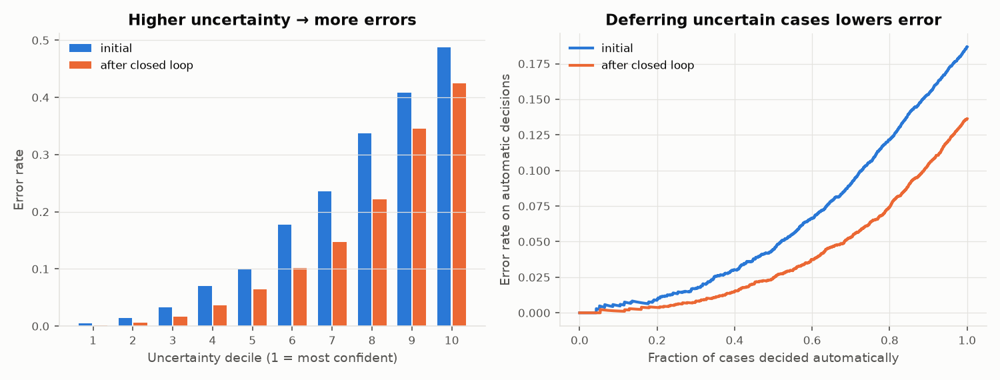
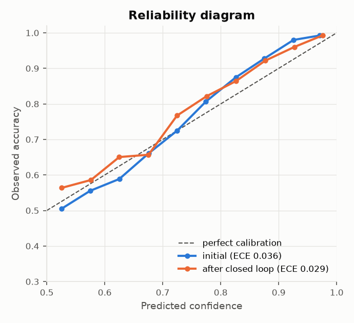
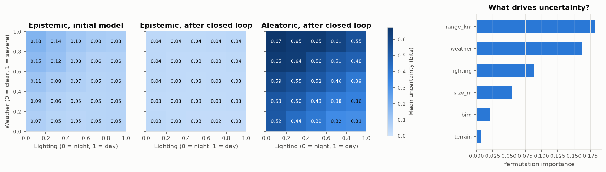
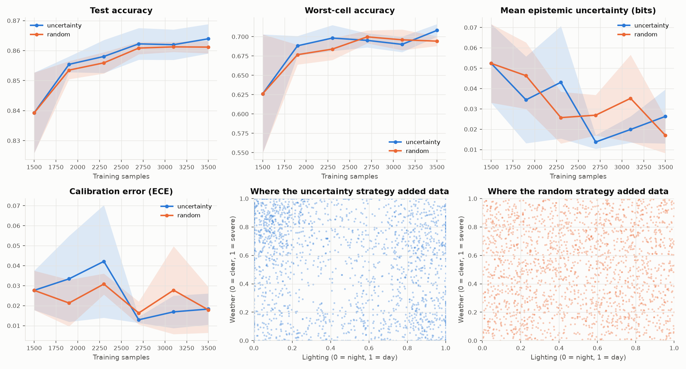
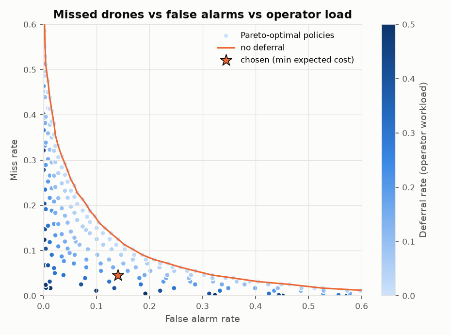
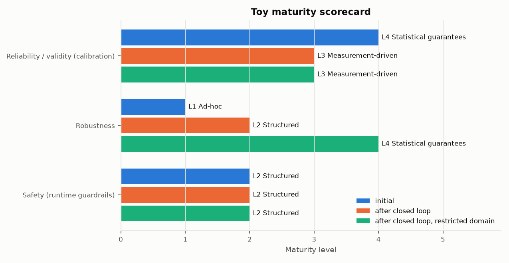

# Results: UQ as a measurement mechanism for maturity-based certification

Generated by `python run_demo.py --seeds 5 --rounds 5`.
All data is synthetic (see `uq_certification/simulator.py`). The numbers show
how the mechanisms behave. They are not claims about any real detector.

## 1. Uncertainty tracks error
The paper's preliminary finding: the model is less likely to be correct when
its uncertainty is high.

## 2. Calibration

| Measurement | Initial model | After closed loop |
|---|---|---|
| Accuracy | 0.813 | 0.864 |
| Expected calibration error | 0.036 | 0.029 |
| Error-detection AUROC (total uncertainty) | 0.804 | 0.824 |
| Error-detection AUROC (epistemic only) | 0.678 | 0.530 |
| Mean epistemic uncertainty (bits) | 0.081 | 0.032 |
| Mean aleatoric uncertainty (bits) | 0.570 | 0.508 |
| Conformal coverage, marginal (target 0.90) | 0.898 | 0.900 |
| Conformal coverage, per-cell Mondrian (target 0.90) | 0.911 | 0.914 |
| Drone-class coverage, Mondrian | 0.915 | 0.913 |
| Ambiguous prediction sets → operator | 0.201 | 0.146 |

## 3. What drives uncertainty
The heatmaps split uncertainty into **epistemic** (model ignorance, which more
data can fix) and **aleatoric** (noise in the sensors themselves, which it
can't). A random forest attributes the initial model's uncertainty to scene
parameters. Ranked by permutation importance:
`range_km` (0.183), `weather` (0.163), `lighting` (0.089), `size_m` (0.054), `bird` (0.020), `terrain` (0.007).

## 4. Closed-loop, uncertainty-guided data generation
Each round adds 400 samples. The guided strategy perturbs the scene
parameters of the most uncertain candidates. The random strategy samples the
whole domain uniformly. Mean ± sd over 5 seeds on the same test set:

| Training data | n | Accuracy | Worst-cell accuracy | Mean epistemic | ECE |
|---|---|---|---|---|---|
| initial (skewed data) | 1500 | 0.839 ± 0.013 | 0.626 ± 0.077 | 0.052 ± 0.019 | 0.028 ± 0.010 |
| + random data | 3500 | 0.861 ± 0.002 | 0.694 ± 0.006 | 0.017 ± 0.009 | 0.018 ± 0.011 |
| + uncertainty-guided data | 3500 | 0.864 ± 0.005 | 0.708 ± 0.008 | 0.026 ± 0.013 | 0.018 ± 0.008 |

## 5. Multi-objective trade-off and runtime guardrail
Policies trade missed drones against false alarms and operator workload
(deferring uncertain cases). The chosen policy minimises expected cost with
explicit weights (miss, false alarm, deferral) = (5.0, 1.0, 0.3), subject to an
operator-capacity constraint of at most 20% deferrals (the
epsilon-constraint method: a weighted sum alone lands on extremes such as
alarming on everything or deferring half of all cases). Selected on
calibration data: alarm threshold t = 0.21, deferral when total
uncertainty > 0.882 bits.

On Pareto optimality: over all three objectives, 369 of
369 grid policies are Pareto-optimal. More deferral always buys
fewer errors (deferred cases are assumed resolved correctly), so that front
rules almost nothing out. Among the 246 policies within
operator capacity, 41 lie on the miss vs false-alarm
Pareto front (the orange line). The chosen policy
is on that front. So the
Pareto analysis narrows the menu and the explicit weights make the final choice. On the test set: miss rate 0.046,
false-alarm rate 0.144, deferral rate 0.200.

## 6. Toy maturity scorecard
Levels are cumulative (see `uq_certification/maturity.py`). The thresholds
were fixed before the first run, with one exception: that run showed a
heavily miss-averse cost weighting could pass Safety L3 and L4 while raising
false alarms on 69% of empty scenes. That is the operator alarm fatigue the
paper warns about, and a textbook case of checkbox compliance. So a
false-alarm limit was added to Safety L3. The third column restricts the declared
operational domain to cells where the final model reaches
75% accuracy on calibration data, which excludes
3 of 36 cells: night/moderate/urban, night/severe/urban, dusk/severe/urban.
Every measurement in that column (calibration, conformal, operating point) is
redone inside the restricted domain. There the chosen policy gets accuracy
0.872, miss rate 0.042, false-alarm
rate 0.175 and deferral rate
0.155.

| Characteristic | Initial | After closed loop | After closed loop, restricted domain |
|---|---|---|---|
| Reliability / validity (calibration) | L4 Statistical guarantees | L3 Measurement-driven | L3 Measurement-driven |
| Robustness | L1 Ad-hoc | L2 Structured | L4 Statistical guarantees |
| Safety (runtime guardrails) | L2 Structured | L2 Structured | L2 Structured |

### Evidence: initial model
| Characteristic | Level | Requirement | Evidence | Met |
|---|---|---|---|---|
| Reliability / validity (calibration) | L1 | Held-out accuracy reported | accuracy = 0.813 | ✅ |
| Reliability / validity (calibration) | L2 | ECE <= 0.1 | ECE = 0.036 | ✅ |
| Reliability / validity (calibration) | L3 | ECE <= 0.05 | ECE = 0.036 | ✅ |
| Reliability / validity (calibration) | L3 | Uncertainty flags errors: AUROC >= 0.75 | AUROC = 0.804 | ✅ |
| Reliability / validity (calibration) | L4 | Conformal coverage within 90% +/- 2% | coverage = 0.898 | ✅ |
| Reliability / validity (calibration) | L4 | Drone-class coverage >= 88% | drone coverage = 0.957 | ✅ |
| Reliability / validity (calibration) | L5 | Formal verification of components | not attempted | ❌ |
| Robustness | L1 | Held-out accuracy reported | accuracy = 0.813 | ✅ |
| Robustness | L2 | Every operational cell tested with >= 50 samples | 36 declared cells, min n = 124 | ✅ |
| Robustness | L2 | Worst-cell accuracy >= 0.7 | night/severe/forest: 0.477 | ❌ |
| Robustness | L3 | Uncertainty-guided scenario generation performed | 0 guided rounds | ❌ |
| Robustness | L3 | Worst-cell accuracy 95% lower bound >= 0.7 | night/severe/forest: 0.406 | ❌ |
| Robustness | L4 | Per-cell conformal coverage not significantly below target | all cells OK | ✅ |
| Robustness | L4 | Runtime monitor defers <= 30% (ambiguous sets) | ambiguous-set rate = 0.201 | ✅ |
| Robustness | L5 | Formal verification of components | not attempted | ❌ |
| Safety (runtime guardrails) | L1 | Fixed decision threshold | P(drone) >= 0.5 | ✅ |
| Safety (runtime guardrails) | L2 | Operating point chosen by explicit cost trade-off | t = 0.31, weights (miss, false alarm, defer) = (5.0, 1.0, 0.3) | ✅ |
| Safety (runtime guardrails) | L3 | Uncertainty-triggered deferral: miss <= 5%, false alarm <= 10% at deferral <= 25% | miss = 0.032, false alarm = 0.191, deferral = 0.203 | ❌ |
| Safety (runtime guardrails) | L4 | Drone-class conformal guarantee holds in every cell (miss-rate bound) | all cells OK | ✅ |
| Safety (runtime guardrails) | L5 | Formally verified safety monitor | not attempted | ❌ |

### Evidence: after closed loop (full operational domain)
| Characteristic | Level | Requirement | Evidence | Met |
|---|---|---|---|---|
| Reliability / validity (calibration) | L1 | Held-out accuracy reported | accuracy = 0.864 | ✅ |
| Reliability / validity (calibration) | L2 | ECE <= 0.1 | ECE = 0.029 | ✅ |
| Reliability / validity (calibration) | L3 | ECE <= 0.05 | ECE = 0.029 | ✅ |
| Reliability / validity (calibration) | L3 | Uncertainty flags errors: AUROC >= 0.75 | AUROC = 0.824 | ✅ |
| Reliability / validity (calibration) | L4 | Conformal coverage within 90% +/- 2% | coverage = 0.900 | ✅ |
| Reliability / validity (calibration) | L4 | Drone-class coverage >= 88% | drone coverage = 0.868 | ❌ |
| Reliability / validity (calibration) | L5 | Formal verification of components | not attempted | ❌ |
| Robustness | L1 | Held-out accuracy reported | accuracy = 0.864 | ✅ |
| Robustness | L2 | Every operational cell tested with >= 50 samples | 36 declared cells, min n = 124 | ✅ |
| Robustness | L2 | Worst-cell accuracy >= 0.7 | dusk/severe/urban: 0.712 | ✅ |
| Robustness | L3 | Uncertainty-guided scenario generation performed | 5 guided rounds | ✅ |
| Robustness | L3 | Worst-cell accuracy 95% lower bound >= 0.7 | night/severe/urban: 0.646 | ❌ |
| Robustness | L4 | Per-cell conformal coverage not significantly below target | all cells OK | ✅ |
| Robustness | L4 | Runtime monitor defers <= 30% (ambiguous sets) | ambiguous-set rate = 0.146 | ✅ |
| Robustness | L5 | Formal verification of components | not attempted | ❌ |
| Safety (runtime guardrails) | L1 | Fixed decision threshold | P(drone) >= 0.5 | ✅ |
| Safety (runtime guardrails) | L2 | Operating point chosen by explicit cost trade-off | t = 0.21, weights (miss, false alarm, defer) = (5.0, 1.0, 0.3) | ✅ |
| Safety (runtime guardrails) | L3 | Uncertainty-triggered deferral: miss <= 5%, false alarm <= 10% at deferral <= 25% | miss = 0.046, false alarm = 0.144, deferral = 0.200 | ❌ |
| Safety (runtime guardrails) | L4 | Drone-class conformal guarantee holds in every cell (miss-rate bound) | all cells OK | ✅ |
| Safety (runtime guardrails) | L5 | Formally verified safety monitor | not attempted | ❌ |

### Evidence: after closed loop (restricted operational domain)
| Characteristic | Level | Requirement | Evidence | Met |
|---|---|---|---|---|
| Reliability / validity (calibration) | L1 | Held-out accuracy reported | accuracy = 0.872 | ✅ |
| Reliability / validity (calibration) | L2 | ECE <= 0.1 | ECE = 0.034 | ✅ |
| Reliability / validity (calibration) | L3 | ECE <= 0.05 | ECE = 0.034 | ✅ |
| Reliability / validity (calibration) | L3 | Uncertainty flags errors: AUROC >= 0.75 | AUROC = 0.830 | ✅ |
| Reliability / validity (calibration) | L4 | Conformal coverage within 90% +/- 2% | coverage = 0.900 | ✅ |
| Reliability / validity (calibration) | L4 | Drone-class coverage >= 88% | drone coverage = 0.868 | ❌ |
| Reliability / validity (calibration) | L5 | Formal verification of components | not attempted | ❌ |
| Robustness | L1 | Held-out accuracy reported | accuracy = 0.872 | ✅ |
| Robustness | L2 | Every operational cell tested with >= 50 samples | 33 declared cells, min n = 124 | ✅ |
| Robustness | L2 | Worst-cell accuracy >= 0.7 | night/severe/forest: 0.769 | ✅ |
| Robustness | L3 | Uncertainty-guided scenario generation performed | 5 guided rounds | ✅ |
| Robustness | L3 | Worst-cell accuracy 95% lower bound >= 0.7 | night/severe/forest: 0.703 | ✅ |
| Robustness | L4 | Per-cell conformal coverage not significantly below target | all cells OK | ✅ |
| Robustness | L4 | Runtime monitor defers <= 30% (ambiguous sets) | ambiguous-set rate = 0.123 | ✅ |
| Robustness | L5 | Formal verification of components | not attempted | ❌ |
| Safety (runtime guardrails) | L1 | Fixed decision threshold | P(drone) >= 0.5 | ✅ |
| Safety (runtime guardrails) | L2 | Operating point chosen by explicit cost trade-off | t = 0.21, weights (miss, false alarm, defer) = (5.0, 1.0, 0.3) | ✅ |
| Safety (runtime guardrails) | L3 | Uncertainty-triggered deferral: miss <= 5%, false alarm <= 10% at deferral <= 25% | miss = 0.042, false alarm = 0.175, deferral = 0.155 | ❌ |
| Safety (runtime guardrails) | L4 | Drone-class conformal guarantee holds in every cell (miss-rate bound) | all cells OK | ✅ |
| Safety (runtime guardrails) | L5 | Formally verified safety monitor | not attempted | ❌ |
